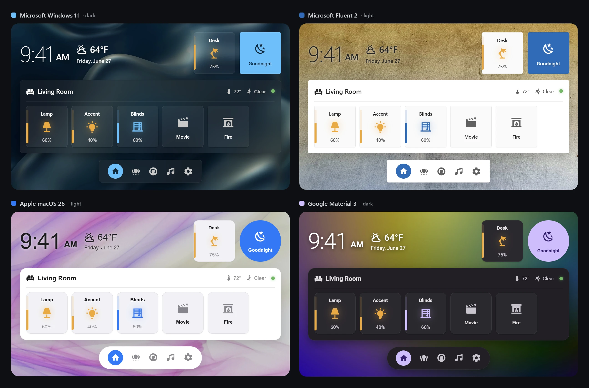
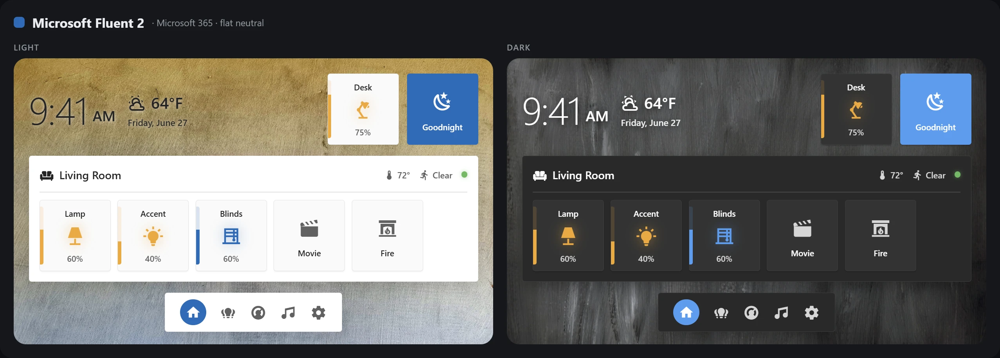
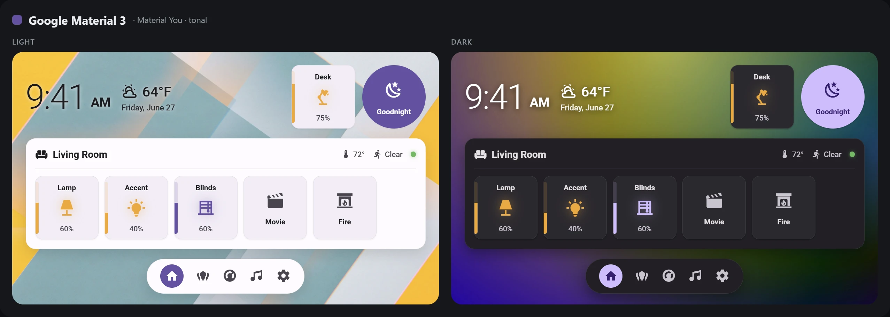

# Ted's Theme Collection for Home Assistant

Four native Home Assistant themes that recreate the world's major UI design languages — **no add-ons required**. Each works on stock Home Assistant 2026.x, ships light + dark via `modes:` (so HA's **Auto** option follows your OS), and uses both the new HA 2026.x `--ha-color-*` token system and the legacy `--paper-*` / `--mdc-*` / `--primary-*` aliases for cross-version compatibility.

| Theme | Design language | Look | Accent (light / dark) |
| --- | --- | --- | --- |
| **Microsoft Windows UI** | Windows 11 desktop (Fluent Design) | Mica/Acrylic translucency, Segoe UI Variable, 8 px cards, wallpaper | `#0078D4` / `#4CC2FF` |
| **Microsoft Fluent 2** | Fluent 2 (Microsoft 365 / Teams / web) | Flat, solid neutral surfaces, Segoe UI, 4 px cards | `#0F6CBD` / `#479EF5` |
| **Apple HIG** | Apple Human Interface Guidelines (iOS / macOS) | Grouped surfaces, SF Pro, 12 px cards, system blue | `#007AFF` / `#0A84FF` |
| **Google Material 3** | Material Design 3 / Material You | Tonal surfaces, Roboto / Google Sans, 12 px cards, 28 px dialogs, pill buttons | `#6750A4` / `#D0BCFF` |

> **Note for existing users:** the original **Windows 11** theme has been renamed to **Microsoft Windows UI**. After updating, re-select it in your Profile (the old "Windows 11" name will no longer appear).

---

## Preview

The dashboards below are built with [**Ted's Cards**](https://github.com/tedr91/HA-Teds-Cards) — set any card to `theme: ha` and it automatically follows whichever theme you've selected, so the same dashboard takes on each design language (and rides on each theme's bundled wallpaper).



<details open>
<summary><b>Each theme — light &amp; dark</b></summary>

#### Microsoft Windows UI


#### Microsoft Fluent 2


#### Apple HIG


#### Google Material 3


</details>

> The card layouts above are visual mock-ups for illustration; install [Ted's Cards](https://github.com/tedr91/HA-Teds-Cards) to use them in your own dashboards.

---

## Installation

### Option 1 — HACS (recommended)

1. HACS → ⋮ → **Custom repositories** → add this repo's URL with category **Theme**.
2. Find **Ted's Theme Collection** in HACS → Themes, install, then restart Home Assistant.
3. Open your **Profile** (bottom-left avatar) and pick one of **Microsoft Windows UI**, **Microsoft Fluent 2**, **Apple HIG**, or **Google Material 3** as the theme. Set **Theme mode** to **Auto** to follow the OS.

### Option 2 — Manual

1. Copy the theme file(s) you want from [themes/](themes/) into your Home Assistant `config/themes/` folder:
   - [themes/microsoft-windows-ui.yaml](themes/microsoft-windows-ui.yaml) — Microsoft Windows UI
   - [themes/microsoft-fluent2.yaml](themes/microsoft-fluent2.yaml) — Microsoft Fluent 2
   - [themes/apple-hig.yaml](themes/apple-hig.yaml) — Apple HIG
   - [themes/google-material-3.yaml](themes/google-material-3.yaml) — Google Material 3
   - Create the `themes/` folder if it does not exist.
2. Add the following to `configuration.yaml` (skip if you already have a `frontend:` block with `themes:`):

   ```yaml
   frontend:
     themes: !include_dir_merge_named themes
   ```

3. Restart Home Assistant (**Developer Tools → YAML → Restart**, or full restart).
4. Select your theme in your Profile as above.

> **Tip:** Every theme ships its own **light + dark wallpaper**, enabled by default. The **Microsoft Windows UI** and **Apple HIG** themes use translucency, so their Mica/glass blur looks best over the wallpaper; **Microsoft Fluent 2** and **Google Material 3** keep solid, opaque cards on top. To go fully flat, set `lovelace-background` to a solid color (see Backgrounds below).

---

## Known limitations

### Dropdown row-action menus (translucent themes)

This applies to the **Microsoft Windows UI** and **Apple HIG** themes, which use translucency. The **Microsoft Fluent 2** and **Google Material 3** themes are fully solid, so they are unaffected.

Cards, dialogs (more-info, settings popups, confirmations), bottom sheets, and adaptive popovers all get real `backdrop-filter` blur because HA exposes dedicated theme variables (`--ha-card-backdrop-filter`, `--ha-dialog-surface-backdrop-filter`).

The remaining holdout is the **dropdown row-action menu** (the ⋮ menu on automation/script rows), which is built on Web Awesome's `wa-popup`. HA exposes no equivalent backdrop-filter variable for it, and even when blur is applied directly to the menu surface via injected CSS, the browser refuses to paint the blur — a Web Awesome layout/painting quirk that no theme can work around.

To compensate, these themes make the menu surface highly opaque (instead of a translucent fill) so menu items remain readable over busy backgrounds like data tables. They also bump the menu's stroke and elevation shadow to give it more visual depth even without true frost.

---

## Backgrounds (wallpaper)

Every theme ships its **own light + dark wallpaper**, enabled by default and matched to that design language. Each theme's pair lives in its own folder under [backgrounds/](backgrounds/):

| Theme | Folder | Light | Dark |
| --- | --- | --- | --- |
| Microsoft Windows UI | [microsoft-windows-ui/](backgrounds/microsoft-windows-ui/) | smooth blue flow | liquid blue waves |
| Microsoft Fluent 2 | [microsoft-fluent2/](backgrounds/microsoft-fluent2/) | neutral concrete | dark-grey brushstroke |
| Apple HIG | [apple-hig/](backgrounds/apple-hig/) | pastel waves | 3D purple/blue wave |
| Google Material 3 | [google-material-3/](backgrounds/google-material-3/) | geometric shapes | tonal gradient |

A shared library of **7 Win11-style wallpapers** also ships in [backgrounds/general/](backgrounds/general/) for use with any theme.

Wallpapers are served via the [jsDelivr CDN](https://www.jsdelivr.com/) directly from this repo — **no manual download needed** when installing via HACS. They apply to every dashboard view automatically via the native HA theme variable `lovelace-background`.

### Switching to a different bundled wallpaper

Edit the theme file in [themes/](themes/) (e.g. [themes/microsoft-windows-ui.yaml](themes/microsoft-windows-ui.yaml)) and change the filename in the `lovelace-background` line under the `light:` or `dark:` block. The shared `general/` library (preview each by clicking):

| Filename | Mood |
| --- | --- |
| [`Chain.webp`](backgrounds/general/Chain.webp) | Industrial, monochrome |
| [`Leaf.webp`](backgrounds/general/Leaf.webp) | Organic green |
| [`MinimalistMountains.webp`](backgrounds/general/MinimalistMountains.webp) | Soft pastel landscape |
| [`MountainStream.webp`](backgrounds/general/MountainStream.webp) | Cool blues / nature |
| [`RadialGradientBlue.webp`](backgrounds/general/RadialGradientBlue.webp) | Win11 hero gradient |
| [`Railroad.webp`](backgrounds/general/Railroad.webp) | Linear repeating pattern |
| [`SunshineThroughMountains.webp`](backgrounds/general/SunshineThroughMountains.webp) | Warm golden hour |

For example to use `MountainStream.webp` in dark mode:

```yaml
dark:
  lovelace-background: 'center / cover no-repeat fixed url("https://cdn.jsdelivr.net/gh/tedr91/teds-themes@main/backgrounds/general/MountainStream.webp")'
```

### Using local copies (faster, works offline)

If you'd rather host the images locally:

1. Download the desired image(s) from the [backgrounds/](backgrounds/) folder (theme subfolders, or the shared `general/` set)
2. Place them in your Home Assistant `config/www/backgrounds/` folder (create it if it doesn't exist)
3. Replace the URL in the theme with the `/local/...` path:

   ```yaml
   light:
     lovelace-background: 'center / cover no-repeat fixed url("/local/backgrounds/RadialGradientBlue.webp")'
   ```

4. Reload themes (Developer Tools → YAML → **Reload Themes**)

### Disabling the wallpaper

Set `lovelace-background` to a solid color or remove the line entirely:

```yaml
light:
  lovelace-background: 'var(--primary-background-color)'   # flat color
```

### Per-view overrides

Any view can override the theme-level wallpaper using the standard HA view background config — set it in the view editor under **View settings → Background**, or in YAML:

```yaml
views:
  - title: Bedroom
    background:
      image: /local/backgrounds/MountainStream.webp
      size: cover
      alignment: center
      attachment: fixed
```

---

## Customizing the accent color

Each theme ships with its design language's signature accent (**Microsoft Windows UI** `#0078D4`, **Microsoft Fluent 2** `#0F6CBD`, **Apple HIG** `#007AFF`, **Google Material 3** `#6750A4`). To use a different accent, edit the relevant file in [themes/](themes/) — for example [themes/microsoft-windows-ui.yaml](themes/microsoft-windows-ui.yaml) — and change these in **both** the `light:` and `dark:` mode blocks:

```yaml
ha-color-primary-40: '#0078D4'     # ← your accent (hex) — light mode default
ha-color-primary-60: '#4CC2FF'     # ← your accent (lighter) — dark mode default
primary-color: '#0078D4'           # ← legacy alias, same as ha-color-primary-40/60 per mode
accent-color:  '#0078D4'           # ← same as primary-color
rgb-primary-color: '0, 120, 212'   # ← same color in R, G, B
rgb-accent-color: '0, 120, 212'
```

Common Windows 11 accents:

| Name           | Hex (Light) | Hex (Dark) |
| -------------- | ----------- | ---------- |
| Default Blue   | `#0078D4`   | `#4CC2FF`  |
| Yellow Gold    | `#FFB900`   | `#FFC83D`  |
| Orange         | `#CA5010`   | `#F7630C`  |
| Red            | `#E81123`   | `#FF99A4`  |
| Pink           | `#E3008C`   | `#FF8FB9`  |
| Purple         | `#5C2E91`   | `#B4A0FF`  |
| Green          | `#107C10`   | `#6CCB5F`  |
| Teal           | `#038387`   | `#3AA0A4`  |

---

## File structure

```
teds-themes/
├── themes/
│   ├── microsoft-windows-ui.yaml   ← Microsoft Windows UI (Windows 11 / Mica)
│   ├── microsoft-fluent2.yaml      ← Microsoft Fluent 2 (flat, solid)
│   ├── apple-hig.yaml              ← Apple HIG (grouped, SF Pro)
│   └── google-material-3.yaml      ← Google Material 3 (tonal, Roboto)
├── backgrounds/                    ← wallpapers (served via jsDelivr CDN)
│   ├── general/                    ← 7 shared Win11-style wallpapers
│   ├── microsoft-windows-ui/       ← Windows UI light + dark
│   ├── microsoft-fluent2/          ← Fluent 2 light + dark
│   ├── apple-hig/                  ← Apple HIG light + dark
│   └── google-material-3/          ← Material 3 light + dark
├── design-guides/                  ← Fluent 2, Apple HIG & Material 3 reference specs
├── README.md
├── LICENSE
└── .gitignore
```

---

## Credits

- **Microsoft Windows UI** & **Microsoft Fluent 2** — color tokens & opacities derived from Microsoft's public **Fluent 2 / WinUI 3** design specifications.
- **Apple HIG** — color, type, and shape tokens derived from Apple's public **Human Interface Guidelines** (iOS 18 / macOS Sequoia).
- **Google Material 3** — color, type, and shape tokens derived from Google's public **Material Design 3 / Material You** baseline specifications.
- Built for Home Assistant 2026.x (also compatible with earlier versions via legacy token aliases).

## License

[MIT](LICENSE)
